# AI Bidding V2 企业级架构设计

版本：V2.0  
日期：2026-06-09  
目标：将当前 `ai_bidding` 从 Flask + MySQL 原型升级为企业级 AI 投标 Agent 平台。本文关注系统架构、模块职责、RAG、Agent、图片系统、数据库、OpenAPI 和部署。

## 1. 架构基线

当前项目真实基线：

- 后端入口：`main.py`，Flask 注册 `api/bidding.py`、`api/knowledge.py`、`api/generation.py`、`api/research.py`、`api/files.py`、`api/settings.py`、`api/users.py`。
- 数据库：`core/db.py` 使用 MySQL，启动时执行 `SCHEMA_STATEMENTS` 自动建表，已有租户、公司、用户、项目、文件、知识库、chunk、标书、章节、版本、任务、Agent、RAG 证据、响应矩阵、合规、改写、研究等表。
- 文件存储：`storage/storage_service.py` 当前以 MySQL BLOB 为主，支持文件版本。
- 向量：`storage/vector_store.py` 支持 ChromaDB 和 Milvus，Embedding 默认 DashScope `text-embedding-v3`。
- RAG：`services/retrieval_router.py` 为向量召回 + MySQL LIKE 兜底。
- 生成：`api/bidding.py` 的 `/generate-bid-document` 返回 SSE，但只发送章节进度；`services/qwen_client.py` 同步生成章节正文。
- 导出：`export/md_to_word.py` 支持基础 Markdown、表格、Mermaid、封面、页眉页脚。
- 前端：`front/` 是 Vue + Element Plus 用户端/管理端；`frontend/` 是已冻结的旧原生页面。

参考项目可吸收基线：

- 后端按 `backend/api/*`、`backend/ai/*`、`backend/rag/*`、`backend/parsing/*`、`backend/export/*` 拆分。
- 使用 PostgreSQL + pgvector，`migrations/postgres/001_schema.sql` 有 `document_chunks.embedding vector(1024)`、`knowledge_assets.embedding vector(1024)`、`match_knowledge_chunks`、`match_knowledge_assets`。
- `backend/ai/section_writer.py` 支持模型 chunk 流式输出。
- `backend/core/bid_volumes.py` 集中定义技术标、商务标、资格、报价、附件策略。
- `backend/rag/retrieval.py` 支持知识库、图片资产检索和 DashScope Rerank。
- `backend/export/md_to_word.py` 支持目录页、PAGEREF、图片插入、安全图片下载和 LibreOffice 刷新字段。
- 前端 `TiptapBidEditor.tsx` 和 `BidEditor/index.tsx` 已具备 TipTap 编辑器、章节树、批量生成、合规抽屉等形态。

## 2. 总体系统架构

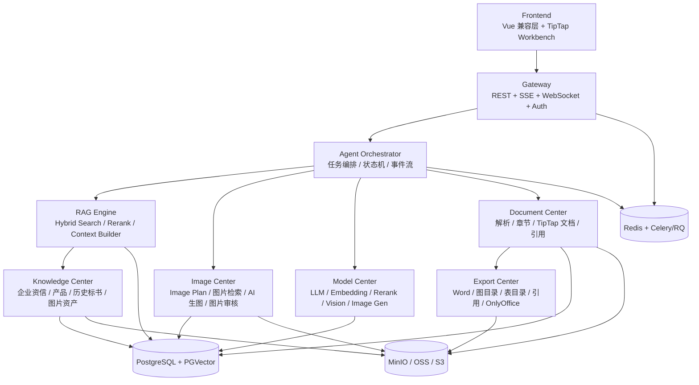

### 2.1 数据流

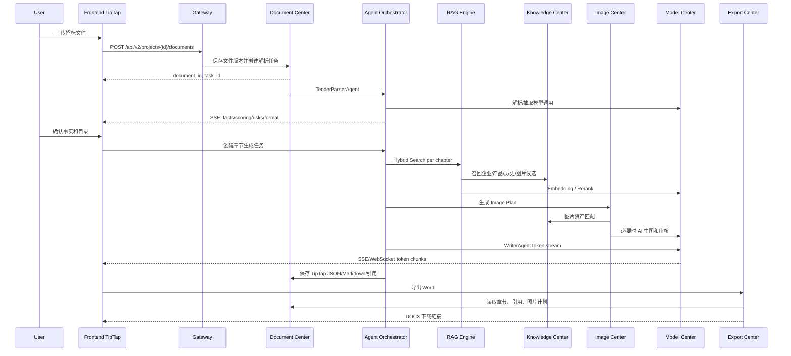

### 2.2 调用链

标准章节生成调用链：

1. Frontend 调用 `POST /api/v2/agent-tasks`，指定 `task_type=chapter_generate`、`chapter_id`。
2. Gateway 创建 `agent_task`，返回 `task_id`，前端连接 `GET /api/v2/streams/tasks/{task_id}`。
3. Orchestrator 加载项目上下文、章节策略、确认事实、响应矩阵。
4. RAG Engine 对章节执行 Hybrid Search，并写 `retrieval_log`。
5. Context Builder 构造带引用编号的上下文。
6. Image Planning Agent 输出 `image_plan`，必要时 Image Center 生成或召回图片。
7. Writer Agent 使用分册策略和 context token 流式生成。
8. Citation Collector 把进入 prompt 的证据和最终段落建立 `citation_record`。
9. Reviewer Agent 检查缺失、重复、格式、风险、引用。
10. TipTap 接收 chunk，更新章节文档；任务完成后写 `bid_chapter_versions`。

## 3. 模块职责

### 3.1 Frontend

当前 `front/src/user/views/Generation.vue` 的五步流程保留为项目工作流入口，但主编辑体验升级为 TipTap Workbench。V2 前端职责：

- 项目列表、上传、解析状态、事实确认、格式确认。
- 分册目录管理：技术标、商务标、资格标、报价标、附件。
- TipTap 编辑器：章节正文、图片节点、表格、引用标记、评论、修订建议。
- AI 工具：续写、改写、润色、扩写、压缩、问答、选区优化。
- SSE/WebSocket 事件消费：token、Agent 状态、RAG 命中、图片计划、风险。
- 知识中心管理：企业资信、产品、历史标书、图片资产。
- 导出与审核：覆盖率、缺失资料、图片计划、引用清单、Word 下载。

### 3.2 Gateway

Gateway 可先由 Flask 蓝图承担，后续可迁移 FastAPI/ASGI。职责：

- `/api/v2` REST 接口。
- SSE 单向流：章节生成、知识问答、导出进度、Agent 事件。
- WebSocket 双向流：协同编辑、评论、修订、任务控制。
- 鉴权、租户隔离、上传校验、速率限制、审计。
- 兼容旧接口：`/api/bidding/upload`、`/pre-analysis_bid`、`/chapter-design`、`/generate-bid-document`。

### 3.3 Agent Orchestrator

职责：

- 管理 Agent 状态机和任务恢复。
- 统一 Agent 上下文，连接 RAG、Model、Image、Document。
- 将事件写入 `agent_task_event` 并推送给前端。
- 支持取消、重试、继续生成、局部重跑。
- 维护章节生成、图片规划、审核、导出的 DAG。

### 3.4 RAG Engine

职责：

- Query Rewrite：基于章节标题、评分项、行业、分册策略构造查询。
- Keyword Recall：PostgreSQL Full Text Search。
- Vector Recall：PGVector。
- Rerank：DashScope Rerank 或兼容 rerank 服务。
- Context Builder：去重、配额、token 预算、引用编号、禁编造提示。
- Retrieval Log：记录查询、候选、分数、进入上下文结果。

### 3.5 Knowledge Center

职责：

- 企业资信库、产品库、历史标书库、图片资产库 CRUD。
- 文档解析、图片 OCR、AI caption、metadata enrichment。
- 资料审核、脱敏、复用政策、权限。
- 统一 chunk 和 embedding。

### 3.6 Image Center

职责：

- 图片规划 Agent。
- 图片资产检索和优先级选择。
- Prompt 模板继承：行业、企业、项目、章节。
- AI 生图适配：ComfyUI、Flux、SDXL、Qwen Image。
- 图片审核 Agent。
- 图片编号、图注、来源、图目录。

### 3.7 Model Center

职责：

- LLM chat/stream。
- Embedding。
- Rerank。
- Vision/OCR caption。
- Image generation。
- 成本与用量统计。
- 多模型路由、fallback、重试、熔断。

当前 `services/model_router.py` 是起点，参考项目 `backend/ai/qwen_client.py` 的 stream 和 usage log 是实现参考。

### 3.8 Document Center

职责：

- 招标文件解析、版本、原文定位。
- 标书章节树、TipTap JSON、Markdown 快照、版本。
- 事实、评分项、风险项、响应矩阵。
- citation record、评论、修订、协同状态。

### 3.9 Export Center

职责：

- 生成 Markdown 快照。
- Word 排版、封面、目录、页眉页脚。
- 图片自动插入、图编号、图目录、表目录、交叉引用。
- 引用清单、尾注/脚注。
- LibreOffice headless 刷新目录页码。
- OnlyOffice 终稿编辑配置与回调。

## 4. 企业级 RAG 设计

### 4.1 Hybrid Search 架构

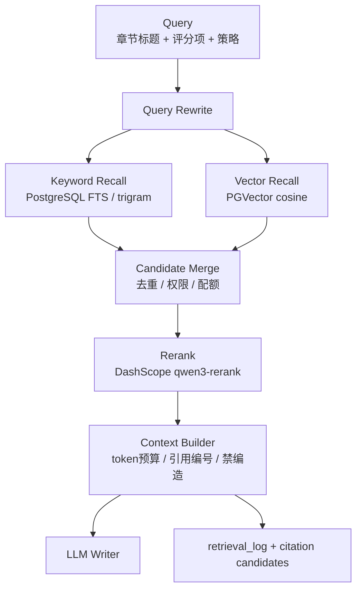

### 4.2 Chunk 策略

当前 `services/ingestion_service.split_text` 使用 1200 字符、150 overlap。V2 改为按文档类型分层：

| 类型 | Chunk 粒度 | Overlap | Metadata |
| --- | --- | --- | --- |
| 招标文件 | 标题/条款/评分表优先，超长条款 800-1200 字 | 120-180 字 | page_start、page_end、section_path、requirement_type、risk_level |
| 企业资信 | 单证书/单人员/单业绩/单段简介 | 50-100 字 | fact_type、valid_until、review_status、sensitive |
| 产品资料 | 单产品介绍、单参数表、单方案段落 | 100-150 字 | product_id、parameter_names、industry、applicable_sections |
| 历史标书 | 章节级 + 段落级双索引 | 150-250 字 | bid_type、volume_type、won_status、reuse_policy |
| 图片资产 | 图片 caption + OCR + 上下文 | 无 | image_asset_id、image_type、source、synthetic、allowed_for_bid |

### 4.3 Embedding 策略

- 默认模型：DashScope `text-embedding-v3`，维度 1024，与参考项目 PGVector 维度一致。
- Query embedding 和 Document embedding 分离记录 `embedding_model`、`embedding_dim`。
- 图片资产不直接 embed 图片二进制，先生成 `searchable_text = title + caption + OCR + tags + applicable_sections + specs`。
- 产品参数和证书编号同时进入 keyword index，不能只依赖 embedding。
- 所有 embedding 任务写入 `embedding_status`、`embedding_updated_at`、`embedding_hash`，文本变更后增量更新。

### 4.4 Metadata 设计

核心 metadata：

```json
{
  "tenant_id": 1,
  "company_id": 1,
  "knowledge_base_id": 12,
  "document_id": 34,
  "file_id": 56,
  "source_type": "product_library",
  "doc_type": "product_spec",
  "volume_type": "technical",
  "section_path": "技术标/产品响应/关键参数",
  "page_start": 10,
  "page_end": 11,
  "chunk_index": 3,
  "reuse_policy": "rewrite_required",
  "confidentiality_level": "internal",
  "review_status": "approved"
}
```

### 4.5 Hybrid Score 公式

候选初分：

```text
keyword_score = ts_rank_cd(search_vector, websearch_to_tsquery(query))
vector_score = 1 - cosine_distance(query_embedding, chunk_embedding)
metadata_boost = source_boost + volume_boost + freshness_boost + review_boost
hybrid_score = 0.42 * norm(keyword_score)
             + 0.43 * norm(vector_score)
             + 0.10 * metadata_boost
             + 0.05 * exact_match_boost
```

Rerank 后终分：

```text
final_score = 0.65 * rerank_score
            + 0.25 * hybrid_score
            + 0.10 * business_priority_boost
```

分册 source_boost：

- 技术标：产品库 +0.15，历史技术标 +0.12，图片资产 +0.08。
- 商务标：商务模板 +0.15，企业资信 +0.10。
- 资格标：企业资信 +0.20，历史资格文件 +0.08。
- 报价标：当前项目报价资料 +0.20，历史报价仅 +0.02 且禁止具体金额复用。
- 附件：图片资产 +0.15，企业资信 +0.10。

### 4.6 时序图

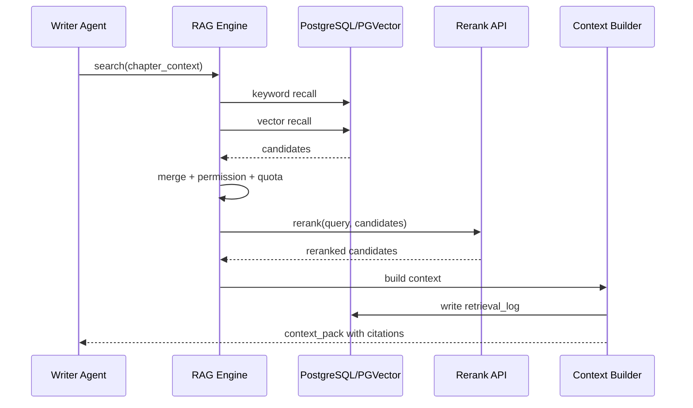

### 4.7 缓存设计

- Query Cache：`rag_cache:{tenant}:{hash(query+filters)}`，TTL 10 分钟。
- Embedding Cache：`embedding:{model}:{sha256(text)}`，长期。
- Context Pack Cache：`context:{project}:{chapter}:{strategy_hash}`，章节生成期间有效。
- Rerank Cache：`rerank:{model}:{query_hash}:{candidate_ids_hash}`，TTL 30 分钟。
- 图片候选 Cache：`image_candidates:{chapter_id}:{image_type}`，TTL 1 小时。

### 4.8 索引设计

- `knowledge_chunk.search_vector` GIN。
- `knowledge_chunk.embedding` HNSW 或 IVFFLAT。
- `knowledge_chunk(tenant_id, source_type, doc_type, review_status)`。
- `image_asset.embedding` HNSW/IVFFLAT。
- `image_asset.tags` GIN。
- `image_asset.applicable_sections` GIN。
- `image_asset(industry, image_type, status, allowed_for_bid)`。
- `citation_record(project_id, chapter_id)`。
- `retrieval_log(project_id, created_at desc)`。

## 5. 多 Agent 架构

### 5.1 Agent 执行流程图

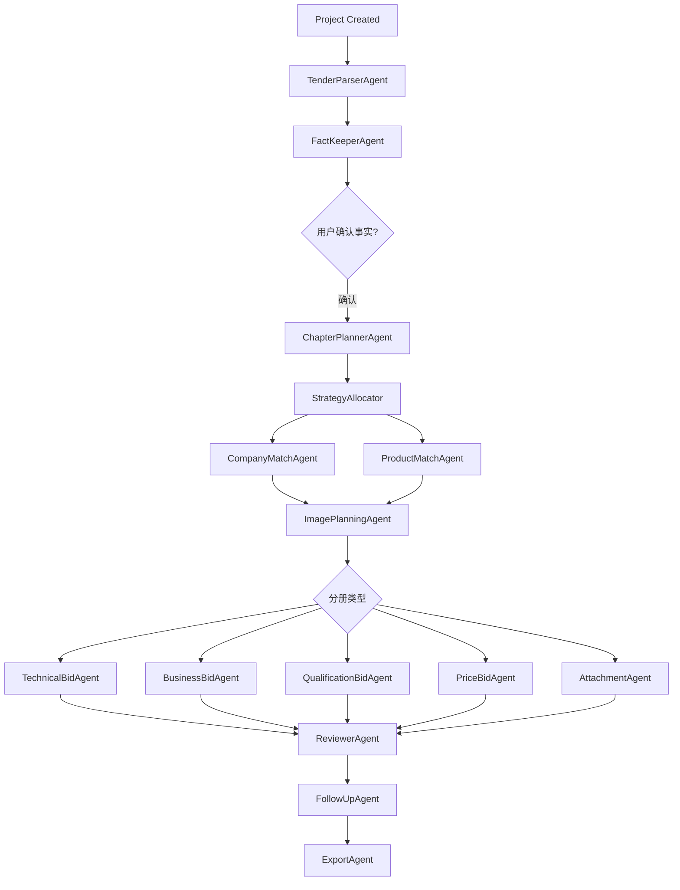

### 5.2 Agent 状态机

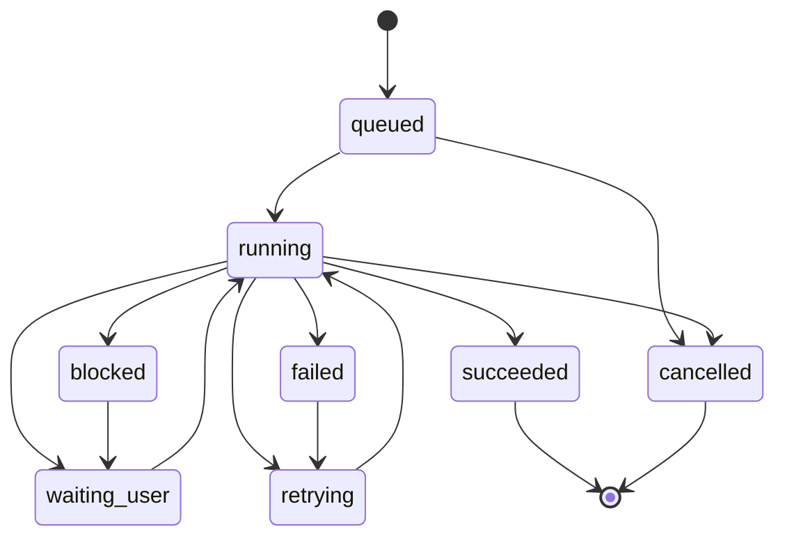

### 5.3 Agent 上下文设计

```json
{
  "task_id": "uuid",
  "tenant_id": 1,
  "project_id": "uuid",
  "chapter_id": "uuid",
  "agent_name": "TechnicalBidAgent",
  "volume_type": "technical",
  "industry": "power_grid",
  "project_facts": {},
  "tender_requirements": [],
  "scoring_items": [],
  "risk_items": [],
  "chapter_strategy": {},
  "retrieval_context": {
    "evidence_items": [],
    "citation_policy": "required"
  },
  "image_plan": [],
  "editor_context": {
    "selected_text": "",
    "before": "",
    "after": "",
    "tiptap_json": {}
  },
  "constraints": {
    "no_fabrication": true,
    "missing_placeholder": "【待补充：...】"
  }
}
```

### 5.4 Agent Prompt 协议

所有 Agent prompt 由模板系统渲染，输出严格 JSON 或 token text。核心要求：

- System：角色、行业、禁编造、引用规则。
- Developer：输出 schema、错误处理、缺资料策略。
- User：项目事实、章节目标、RAG context、图片计划、分册策略。
- Output：`content`、`citations`、`missing_info`、`risk_flags`、`image_insertions`。

示例 Writer 输出事件：

```json
{
  "type": "chunk",
  "chapter_id": "uuid",
  "content": "本项目技术方案...",
  "citation_refs": ["CIT-001"],
  "offset": 128
}
```

## 6. 分册策略系统

### 6.1 Strategy Pattern

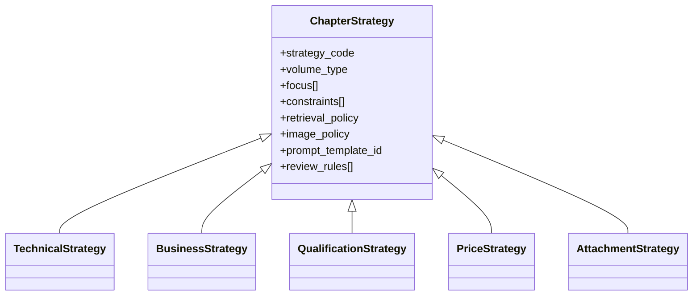

### 6.2 策略表述

- 技术标：技术方案、产品能力、案例、实施路径、质量安全、进度资源，允许产品图、设备图、流程图。
- 商务标：企业实力、项目经验、服务能力、合同响应、承诺，禁止编造金额日期签章。
- 资格标：资质、证书、人员、业绩、信誉，证照图片必须标明来源和脱敏。
- 报价标：报价说明、成本逻辑、清单复核，禁止编造具体金额和税率。
- 附件：自动引用资料、附件来源、是否缺失、替换要求。

## 7. 智能图片系统

### 7.1 Image Plan Schema

```json
{
  "chapter_id": "uuid",
  "section_path": "技术标/项目实施方案/组织架构",
  "need_image": true,
  "image_type": "organization_chart",
  "image_count": 1,
  "placement": "after_heading",
  "caption": "项目组织架构图",
  "source_priority": ["enterprise_image", "history_bid_image", "ai_generated"],
  "asset_query": "项目组织架构 管理团队 标书",
  "prompt_hint": "正式投标文件组织架构图，蓝白工业风",
  "required_resolution": "1600x1000",
  "risk_notes": ["不得生成具体人员姓名，除非企业资料已确认"]
}
```

### 7.2 图片来源优先级

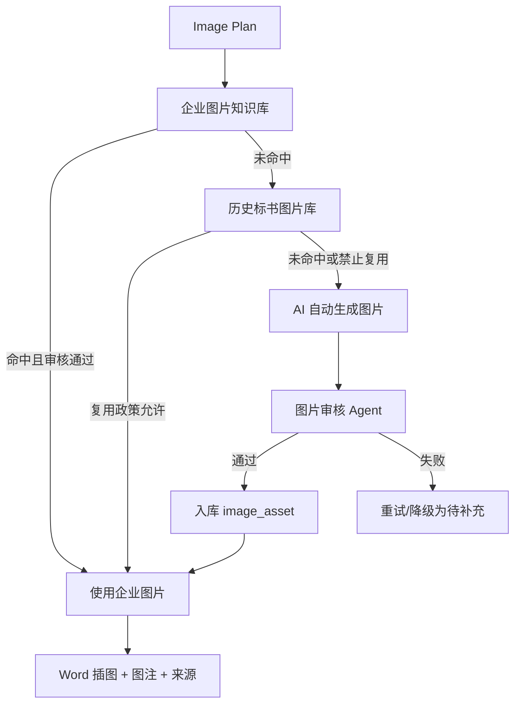

### 7.3 行业识别与模板

行业枚举：`power_grid`、`new_energy`、`construction`、`manufacturing`、`medical`、`transportation`、`water_conservancy`、`education`、`communication`、`military`、`government`、`other`。

模板继承：

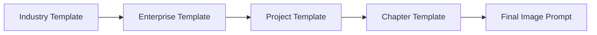

电网模板示例：

- positive：国家电网风格、输电线路、变电站、电力设备、工业蓝白风格、真实工程场景。
- negative：AI 插画风、卡通、错误文字、伪造证书、夸张科幻、模糊。

建筑模板示例：

- positive：BIM、工程现场、施工管理、建筑效果图、真实工程光照。
- negative：卡通工地、低清、危险施工、虚假品牌。

医疗模板示例：

- positive：医院环境、医疗设备、临床场景、洁净空间、真实摄影。
- negative：血腥、误导性诊断、虚假药品、卡通。

### 7.4 AI 生图流程

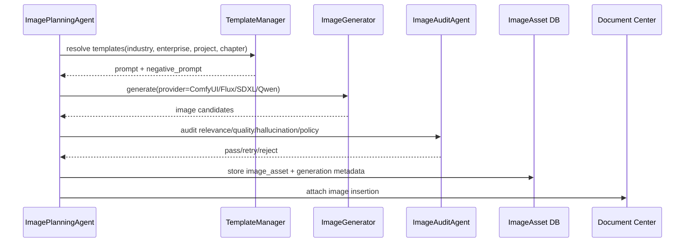

### 7.5 Word 自动插图

导出时根据 `image_plan` 和 `image_asset` 生成：

- 图片编号：`图 {chapter_no}-{image_index}`。
- 图片说明：Image Plan caption。
- 图片来源：企业图片库/历史标书/AI 生成。
- 图目录：按编号列出 caption 和页码。
- 交叉引用：正文可引用“见图 3-1”。

## 8. 引用溯源系统

引用记录在生成和导出两个阶段创建：

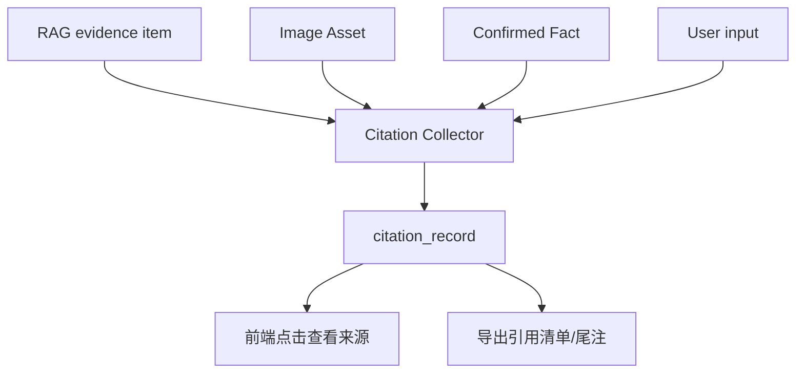

引用类型：

- `tender_requirement`：招标原文。
- `company_profile`：企业资料。
- `product_parameter`：产品参数。
- `bid_history`：历史标书。
- `image_asset`：图片。
- `user_confirmed_fact`：用户确认事实。
- `ai_generated_suggestion`：无事实来源的 AI 建议。

## 9. 长文本生成系统

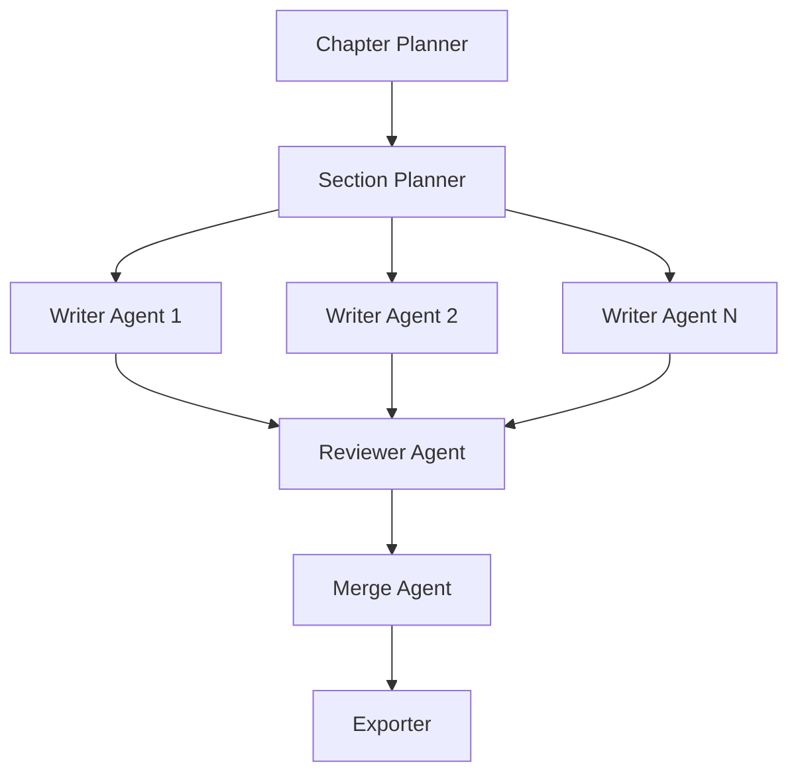

关键设计：

- 大章拆成 section tasks，每个 task 有独立 RAG context。
- Project Memory 存术语、事实和已写摘要，防止重复。
- Reviewer 检查字数、覆盖、重复、引用和风险。
- Merge Agent 统一编号、术语、图表、引用。

## 10. 数据库升级

### 10.1 ER 图

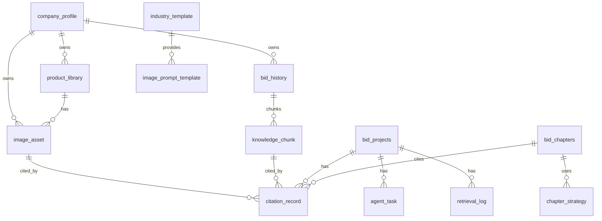

### 10.2 PostgreSQL DDL

> 当前项目是 MySQL。V2 企业级 RAG 推荐 PostgreSQL + PGVector。若 P0 暂留 MySQL，应先按同名表建立兼容字段，P1 迁移到 PostgreSQL。

```sql
create extension if not exists vector;
create extension if not exists pg_trgm;
create extension if not exists zhparser;

create table if not exists company_profile (
  id bigserial primary key,
  tenant_id bigint not null default 1,
  company_id bigint not null default 1,
  company_name varchar(255) not null,
  company_intro text,
  established_at date,
  registered_capital varchar(128),
  employee_scale varchar(128),
  core_qualifications jsonb not null default '[]',
  awards jsonb not null default '[]',
  metadata jsonb not null default '{}',
  review_status varchar(32) not null default 'draft',
  created_at timestamptz not null default now(),
  updated_at timestamptz not null default now()
);

create table if not exists product_library (
  id bigserial primary key,
  tenant_id bigint not null default 1,
  company_id bigint not null default 1,
  product_name varchar(255) not null,
  product_intro text,
  technical_parameters jsonb not null default '{}',
  product_solution text,
  product_cases jsonb not null default '[]',
  industry varchar(128),
  applicable_volumes text[] not null default '{}',
  applicable_sections text[] not null default '{}',
  tags text[] not null default '{}',
  review_status varchar(32) not null default 'draft',
  created_at timestamptz not null default now(),
  updated_at timestamptz not null default now()
);

create table if not exists bid_history (
  id bigserial primary key,
  tenant_id bigint not null default 1,
  company_id bigint not null default 1,
  project_name varchar(500) not null,
  customer_name varchar(255),
  industry varchar(128),
  region varchar(128),
  bid_year int,
  bid_result varchar(32),
  volume_type varchar(64),
  file_id bigint,
  reuse_policy varchar(32) not null default 'rewrite_required',
  sensitive_level varchar(32) not null default 'internal',
  metadata jsonb not null default '{}',
  created_at timestamptz not null default now(),
  updated_at timestamptz not null default now()
);

create table if not exists image_asset (
  id bigserial primary key,
  tenant_id bigint not null default 1,
  company_id bigint not null default 1,
  product_id bigint references product_library(id),
  bid_history_id bigint references bid_history(id),
  image_title varchar(255) not null,
  image_type varchar(64) not null,
  industry varchar(128),
  description text,
  file_id bigint,
  storage_url text,
  width int,
  height int,
  mime_type varchar(128),
  source_type varchar(64) not null default 'enterprise_upload',
  source_ref_id bigint,
  license text,
  attribution text,
  is_synthetic boolean not null default false,
  is_sensitive boolean not null default false,
  anonymized boolean not null default false,
  allowed_for_bid boolean not null default true,
  applicable_volumes text[] not null default '{}',
  applicable_sections text[] not null default '{}',
  tags text[] not null default '{}',
  ocr_text text,
  ai_caption text,
  searchable_text text,
  embedding vector(1024),
  audit_status varchar(32) not null default 'pending',
  audit_json jsonb not null default '{}',
  generation_json jsonb not null default '{}',
  created_at timestamptz not null default now(),
  updated_at timestamptz not null default now()
);

create table if not exists industry_template (
  id bigserial primary key,
  industry_code varchar(64) not null,
  template_type varchar(64) not null,
  template_name varchar(255) not null,
  template_json jsonb not null default '{}',
  version varchar(32) not null default '1.0.0',
  status varchar(32) not null default 'active',
  created_at timestamptz not null default now(),
  unique(industry_code, template_type, template_name, version)
);

create table if not exists image_prompt_template (
  id bigserial primary key,
  tenant_id bigint not null default 1,
  industry_template_id bigint references industry_template(id),
  scope_type varchar(32) not null,
  scope_id bigint,
  template_name varchar(255) not null,
  image_type varchar(64) not null,
  positive_prompt text not null,
  negative_prompt text,
  style_constraints jsonb not null default '{}',
  audit_rules jsonb not null default '{}',
  parent_template_id bigint references image_prompt_template(id),
  version varchar(32) not null default '1.0.0',
  status varchar(32) not null default 'active',
  created_at timestamptz not null default now()
);

create table if not exists knowledge_chunk (
  id bigserial primary key,
  tenant_id bigint not null default 1,
  company_id bigint,
  source_type varchar(64) not null,
  source_id bigint,
  file_id bigint,
  doc_type varchar(64),
  chunk_index int not null,
  chunk_text text not null,
  chunk_summary text,
  section_path text,
  page_start int,
  page_end int,
  token_count int,
  embedding_model varchar(128),
  embedding vector(1024),
  search_vector tsvector,
  metadata jsonb not null default '{}',
  status varchar(32) not null default 'indexed',
  created_at timestamptz not null default now(),
  updated_at timestamptz not null default now()
);

create table if not exists retrieval_log (
  id bigserial primary key,
  tenant_id bigint not null default 1,
  project_id bigint,
  chapter_id bigint,
  query_text text not null,
  query_json jsonb not null default '{}',
  filters_json jsonb not null default '{}',
  keyword_hits jsonb not null default '[]',
  vector_hits jsonb not null default '[]',
  rerank_hits jsonb not null default '[]',
  selected_context jsonb not null default '[]',
  degraded boolean not null default false,
  degraded_reason text,
  latency_ms int,
  created_at timestamptz not null default now()
);

create table if not exists citation_record (
  id bigserial primary key,
  tenant_id bigint not null default 1,
  project_id bigint not null,
  bid_document_id bigint,
  chapter_id bigint,
  chapter_version_id bigint,
  citation_key varchar(64) not null,
  source_type varchar(64) not null,
  source_id bigint,
  chunk_id bigint references knowledge_chunk(id),
  image_asset_id bigint references image_asset(id),
  source_file_id bigint,
  source_title text,
  source_page int,
  quoted_text text,
  generated_text text,
  usage_type varchar(32) not null default 'reference',
  confidence numeric(5,4),
  metadata jsonb not null default '{}',
  created_at timestamptz not null default now()
);

create table if not exists agent_task (
  id bigserial primary key,
  tenant_id bigint not null default 1,
  project_id bigint,
  chapter_id bigint,
  parent_task_id bigint references agent_task(id),
  agent_name varchar(128) not null,
  task_type varchar(64) not null,
  status varchar(32) not null default 'queued',
  input_json jsonb not null default '{}',
  output_json jsonb not null default '{}',
  error_message text,
  progress int not null default 0,
  started_at timestamptz,
  finished_at timestamptz,
  created_by bigint,
  created_at timestamptz not null default now(),
  updated_at timestamptz not null default now()
);

create table if not exists chapter_strategy (
  id bigserial primary key,
  tenant_id bigint not null default 1,
  project_id bigint,
  chapter_id bigint,
  volume_type varchar(64) not null,
  strategy_code varchar(128) not null,
  target_words int,
  suggested_pages numeric(8,2),
  focus jsonb not null default '[]',
  constraints jsonb not null default '[]',
  retrieval_policy jsonb not null default '{}',
  image_policy jsonb not null default '{}',
  prompt_template_id bigint,
  review_rules jsonb not null default '[]',
  created_at timestamptz not null default now(),
  updated_at timestamptz not null default now()
);
```

### 10.3 索引 DDL

```sql
create index if not exists idx_product_library_tags on product_library using gin(tags);
create index if not exists idx_product_library_sections on product_library using gin(applicable_sections);
create index if not exists idx_bid_history_lookup on bid_history(tenant_id, industry, volume_type, bid_result);
create index if not exists idx_image_asset_embedding on image_asset using ivfflat (embedding vector_cosine_ops) with (lists = 100);
create index if not exists idx_image_asset_tags on image_asset using gin(tags);
create index if not exists idx_image_asset_sections on image_asset using gin(applicable_sections);
create index if not exists idx_image_asset_lookup on image_asset(tenant_id, industry, image_type, audit_status, allowed_for_bid);
create index if not exists idx_knowledge_chunk_embedding on knowledge_chunk using ivfflat (embedding vector_cosine_ops) with (lists = 100);
create index if not exists idx_knowledge_chunk_search on knowledge_chunk using gin(search_vector);
create index if not exists idx_knowledge_chunk_source on knowledge_chunk(tenant_id, source_type, doc_type, status);
create index if not exists idx_retrieval_log_project on retrieval_log(project_id, created_at desc);
create index if not exists idx_citation_chapter on citation_record(project_id, chapter_id);
create index if not exists idx_agent_task_project on agent_task(project_id, status, created_at desc);
create index if not exists idx_chapter_strategy_chapter on chapter_strategy(chapter_id);
```

## 11. OpenAPI 设计

### 11.1 Agent

```yaml
POST /api/v2/agent-tasks:
  body:
    taskType: tender_parse|outline_generate|chapter_generate|image_plan|review|export
    projectId: integer
    chapterId: integer
    input: object
  response:
    taskId: integer
    status: queued

GET /api/v2/agent-tasks/{taskId}:
  response:
    id: integer
    status: string
    progress: integer
    output: object

POST /api/v2/agent-tasks/{taskId}/cancel:
  response:
    status: cancelled
```

### 11.2 RAG

```yaml
POST /api/v2/rag/search:
  body:
    query: string
    projectId: integer
    chapterId: integer
    sourceTypes: [company_profile, product_library, bid_history, image_asset, tender]
    volumeType: technical|business|qualification|price|attachment
    limit: integer
  response:
    items:
      - sourceType: string
        sourceId: integer
        chunkId: integer
        content: string
        score: number
        rerankScore: number
        citationKey: string
    retrievalLogId: integer
```

### 11.3 图片生成与管理

```yaml
POST /api/v2/images/plans:
  body:
    projectId: integer
    chapterId: integer
  response:
    imagePlans: [object]

POST /api/v2/images/generate:
  body:
    imagePlanId: integer
    provider: comfyui|flux|sdxl|qwen_image
  response:
    taskId: integer

GET /api/v2/images/assets:
  parameters:
    imageType: string
    industry: string
    allowedForBid: boolean
  response:
    items: [image_asset]

POST /api/v2/images/assets:
  multipart:
    file: binary
    metadata: json
```

### 11.4 TipTap

```yaml
GET /api/v2/chapters/{chapterId}/editor-doc:
  response:
    tiptapJson: object
    markdown: string
    versionId: integer

PUT /api/v2/chapters/{chapterId}/editor-doc:
  body:
    tiptapJson: object
    markdown: string
    baseVersionId: integer
  response:
    versionId: integer

POST /api/v2/editor/ai:
  body:
    chapterId: integer
    action: continue|rewrite|polish|expand|compress|qa|optimize_selection
    selectedText: string
    instruction: string
  response:
    taskId: integer
```

### 11.5 流式生成

```yaml
GET /api/v2/streams/tasks/{taskId}:
  protocol: SSE
  events:
    - agent_status
    - retrieval
    - image_plan
    - token
    - citation
    - review_issue
    - done
    - error

WS /api/v2/ws/projects/{projectId}:
  messages:
    - editor_update
    - presence
    - comment
    - ai_action
    - task_control
```

### 11.6 导出

```yaml
POST /api/v2/exports:
  body:
    projectId: integer
    scope: full|volume|chapter
    volumeType: technical|business|qualification|price|attachment
    withImages: boolean
    withCitations: boolean
  response:
    taskId: integer

GET /api/v2/exports/{taskId}:
  response:
    status: string
    progress: integer
    fileId: integer
    downloadUrl: string
```

## 12. 部署方案

### 12.1 本地开发

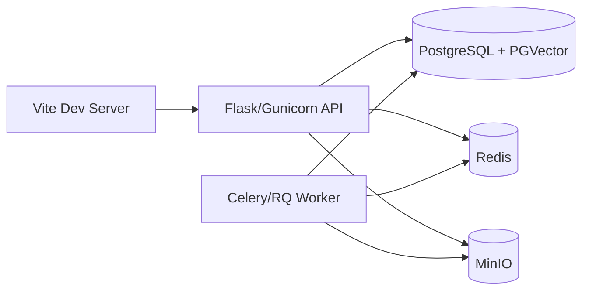

### 12.2 生产私有化

- Nginx：TLS、静态资源、SSE/WebSocket proxy。
- API：Gunicorn gevent 或 ASGI 服务，建议独立 Gateway。
- Worker：Celery/RQ，队列分为 parse、rag、agent、image、export。
- PostgreSQL + PGVector：业务数据、全文索引、向量。
- Redis：队列、缓存、SSE 状态。
- MinIO/OSS/S3：上传文件、解析产物、生成 Word、图片。
- Optional：MinerU OCR 服务、ComfyUI 生图服务、LibreOffice headless 导出服务、OnlyOffice Document Server。

### 12.3 迁移部署

P0 可在当前 Flask + MySQL 上新增 V2 兼容表和服务，避免一次性替换。P1 迁移 PostgreSQL + PGVector，并通过 ETL 将当前 `document_files`、`knowledge_documents`、`document_chunks`、`bid_projects`、`bid_chapters` 映射到新 schema。文件从 MySQL BLOB 导出到对象存储，保留 `file_id` 映射。

## 13. 与当前代码的落点映射

| 当前模块 | V2 归属 | 改造方向 |
| --- | --- | --- |
| `api/bidding.py` | Gateway + Project/Interpret/Outline/Export | 拆分蓝图，保留兼容层 |
| `api/knowledge.py` | Knowledge Center | 拆成企业/产品/历史/图片资产接口 |
| `api/generation.py` | Agent + Editor | 接入 TipTap、流式和 Agent task |
| `services/agent_orchestrator.py` | Agent Orchestrator | 从函数升级状态机 |
| `services/retrieval_router.py` | RAG Engine | Hybrid Search + Rerank + logs |
| `services/model_router.py` | Model Center | 增加 stream、embedding、rerank、image |
| `storage/storage_service.py` | Object Storage | 迁移对象存储，保留版本模型 |
| `export/md_to_word.py` | Export Center | 增强目录、图片、引用、LibreOffice |
| `front/src/user/views/Generation.vue` | Frontend Workflow | 保留流程，接 TipTap Workbench |
| `front/src/user/views/Editor.vue` | OnlyOffice final editor | 降级为终稿编辑 |
| `frontend/` | Legacy | 冻结删除 |

## 14. 关键架构决策

1. V2 默认 PostgreSQL + PGVector，不继续以 Chroma/Milvus 为生产主路径。
2. TipTap 是 AI 主编辑器，OnlyOffice 是终稿/兼容编辑器。
3. 图片系统是生成前规划，不是导出后补图。
4. 所有关键事实必须 citation record，不允许无来源编造。
5. 长任务必须异步化、可恢复、可取消。
6. 旧 API 保留兼容，但新开发只使用 `/api/v2`。
7. 分册策略、行业模板、图片 prompt 模板必须配置化和版本化。
